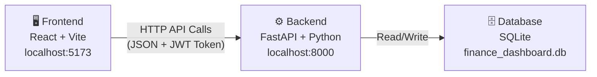
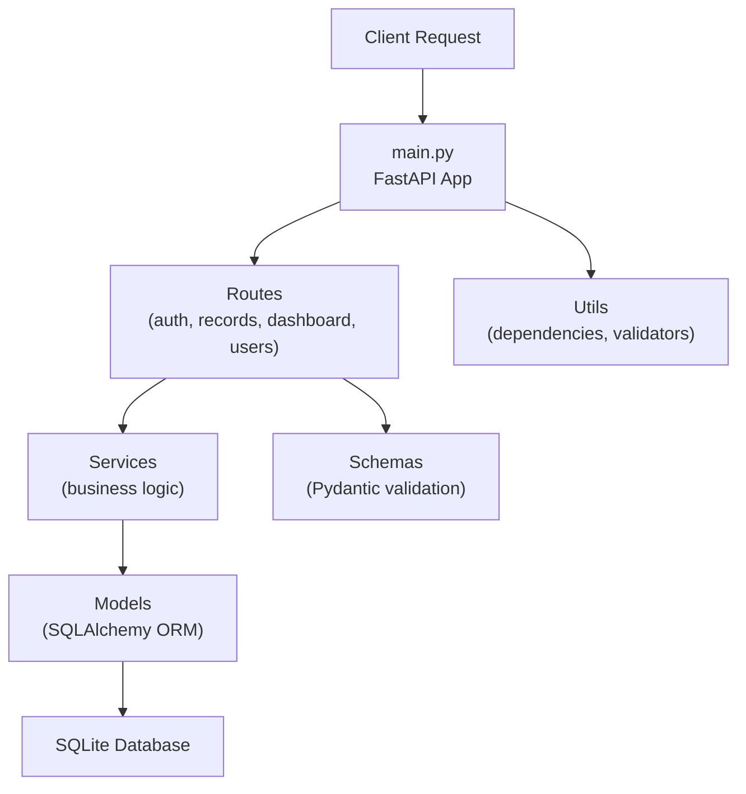
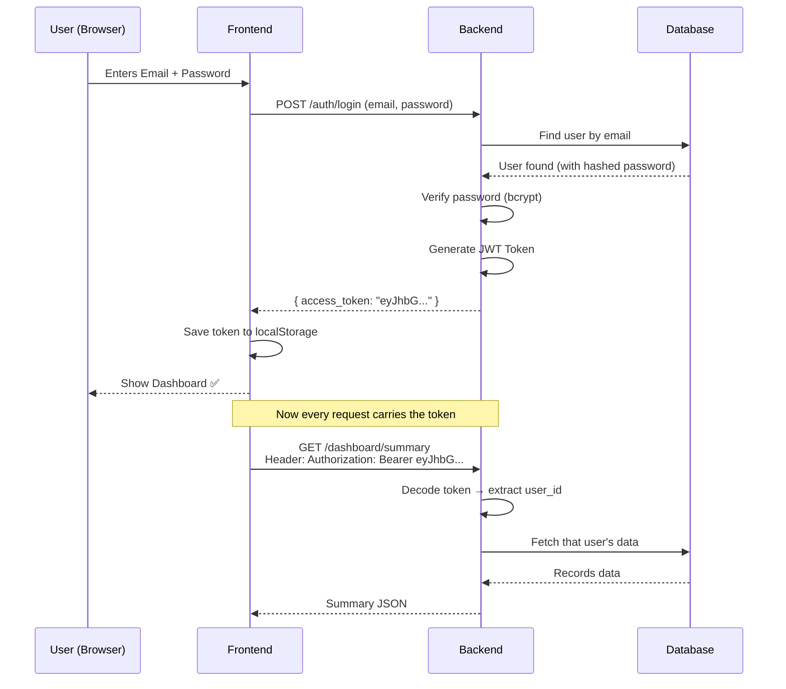
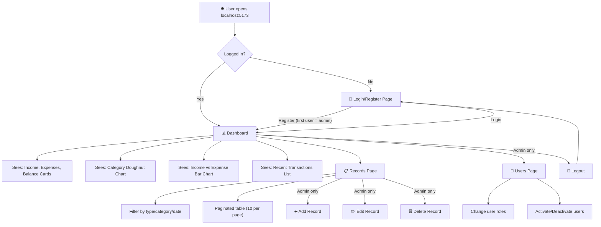

# 🏦 Zorvyn Finance Dashboard — Complete Project Breakdown

## Project Overview

This is a **Finance Dashboard** app — where you can track your income/expenses, view charts, and manage users. The project has **2 parts**:



---

## 🔧 Backend (FastAPI — Python)

**Location:** `d:\Backend_pro\backend\`

### Architecture Flow



### Key Files Explained

| File | What it does |
|---|---|
| [main.py](file:///d:/Backend_pro/backend/main.py) | The app starts here. CORS setup, routes registration, database creation |
| [database.py](file:///d:/Backend_pro/backend/database.py) | Creates a connection to SQLite (`finance_dashboard.db`) |
| [models/user.py](file:///d:/Backend_pro/backend/models/user.py) | **User table** — id, email, password (hashed), role, is_active |
| [models/record.py](file:///d:/Backend_pro/backend/models/record.py) | **Record table** — id, amount, type (income/expense), category, date, notes |
| [routes/auth.py](file:///d:/Backend_pro/backend/routes/auth.py) | `/auth/register`, `/auth/login`, `/auth/me` — signup, login, current user |
| [routes/records.py](file:///d:/Backend_pro/backend/routes/records.py) | `/records` — CRUD (Create, Read, Update, Delete) for financial records |
| [routes/dashboard.py](file:///d:/Backend_pro/backend/routes/dashboard.py) | `/dashboard/summary` — total income, expenses, balance, category breakdown |
| [routes/users.py](file:///d:/Backend_pro/backend/routes/users.py) | `/users` — admin user management (role change, activate/deactivate) |
| [services/auth_service.py](file:///d:/Backend_pro/backend/services/auth_service.py) | Password hashing (bcrypt), JWT token create/decode |
| [services/record_service.py](file:///d:/Backend_pro/backend/services/record_service.py) | Records filtering, pagination, dashboard summary calculations |
| [utils/dependencies.py](file:///d:/Backend_pro/backend/utils/dependencies.py) | Extracts current user from JWT token, role checking |
| [utils/validators.py](file:///d:/Backend_pro/backend/utils/validators.py) | Category name normalize, notes sanitize |

### 🔐 Authentication Flow



### 👥 Role System

| Role | What they can do |
|---|---|
| **admin** | Everything — records CRUD, manage users, dashboard, view own + everyone's records |
| **analyst** | Can view dashboard + records (own records only) |
| **viewer** | Can view dashboard + records (own records only) |

> [!NOTE]
> The first user to register **automatically becomes admin**. All others default to **viewer**.

---

## 🖥️ Frontend (React + Vite)

**Location:** `d:\Backend_pro\frontend\`

### Architecture

```mermaid
graph TD
    A["main.jsx<br/>Entry Point"] --> B["AuthProvider<br/>(login state manage)"]
    B --> C["App.jsx<br/>(Router)"]
    C --> D["LoginPage"]
    C --> E["RegisterPage"]
    C --> F["DashboardPage"]
    C --> G["RecordsPage"]
    C --> H["UsersPage (admin only)"]
    
    F --> I["StatsCard"]
    F --> J["Charts (Doughnut + Bar)"]
    G --> K["RecordTable"]
    G --> L["RecordForm (Modal)"]
    
    C --> M["Navbar"]
    C --> N["ProtectedRoute"]
    
    style D fill:#1a1050
    style E fill:#1a1050
    style F fill:#0e2a1a
    style G fill:#2a1a0e
    style H fill:#2a0e1a
```



### Key Files Explained

| File | What it does |
|---|---|
| [api/client.js](file:///d:/Backend_pro/frontend/src/api/client.js) | **Axios instance** — all API calls go through here. Automatically attaches JWT token |
| [context/AuthContext.jsx](file:///d:/Backend_pro/frontend/src/context/AuthContext.jsx) | **Auth state** — login/logout/register functions, current user info storage |
| [App.jsx](file:///d:/Backend_pro/frontend/src/App.jsx) | **Router** — decides which page to show for which URL |
| [components/Navbar.jsx](file:///d:/Backend_pro/frontend/src/components/Navbar.jsx) | Top navigation bar — links, user info, logout button |
| [components/ProtectedRoute.jsx](file:///d:/Backend_pro/frontend/src/components/ProtectedRoute.jsx) | If not logged in → redirects to `/login`. Non-admin on admin page → redirects to `/` |
| [components/StatsCard.jsx](file:///d:/Backend_pro/frontend/src/components/StatsCard.jsx) | 3 cards on Dashboard — Income, Expenses, Balance |
| [components/Charts.jsx](file:///d:/Backend_pro/frontend/src/components/Charts.jsx) | **Chart.js** — Doughnut (categories) + Bar chart (income vs expense) |
| [components/RecordForm.jsx](file:///d:/Backend_pro/frontend/src/components/RecordForm.jsx) | Create/Edit record modal popup form |
| [components/RecordTable.jsx](file:///d:/Backend_pro/frontend/src/components/RecordTable.jsx) | Records table — date, type, category, amount, actions |
| [pages/LoginPage.jsx](file:///d:/Backend_pro/frontend/src/pages/LoginPage.jsx) | Login screen — email, password, sign in button |
| [pages/RegisterPage.jsx](file:///d:/Backend_pro/frontend/src/pages/RegisterPage.jsx) | Register screen — email, password, confirm password |
| [pages/DashboardPage.jsx](file:///d:/Backend_pro/frontend/src/pages/DashboardPage.jsx) | Main dashboard — stats + charts + recent transactions |
| [pages/RecordsPage.jsx](file:///d:/Backend_pro/frontend/src/pages/RecordsPage.jsx) | Records list — filters, pagination, add/edit/delete |
| [pages/UsersPage.jsx](file:///d:/Backend_pro/frontend/src/pages/UsersPage.jsx) | Admin page — user cards, role change dropdown, activate/deactivate |
| [index.css](file:///d:/Backend_pro/frontend/src/index.css) | **Design system** — colors, fonts, animations, glassmorphism, responsive |

---

## 🔄 Complete User Journey



---

## 🏗️ Tech Stack Summary

| Layer | Technology | Why |
|---|---|---|
| **Backend Framework** | FastAPI | Fast, modern Python API framework with auto docs |
| **Database** | SQLite | Simple file-based database, no setup needed |
| **ORM** | SQLAlchemy | Python objects ↔ database tables mapping |
| **Auth** | JWT (python-jose) + bcrypt | Secure token-based authentication |
| **Validation** | Pydantic | Request/response data validation |
| **Frontend Framework** | React 18 | Component-based UI library |
| **Build Tool** | Vite | Super fast development server |
| **HTTP Client** | Axios | API calls with interceptors |
| **Charts** | Chart.js + react-chartjs-2 | Beautiful interactive charts |
| **Icons** | Lucide React | Clean, consistent icon set |
| **Notifications** | react-hot-toast | Toast popup messages |
| **Routing** | react-router-dom | Client-side page navigation |
| **Styling** | Vanilla CSS | Custom design system, glassmorphism |

---

## 📁 Full Project Structure

```
d:\Backend_pro\
├── backend/                    ← Python FastAPI Backend
│   ├── main.py                 ← App entry + CORS + route registration
│   ├── database.py             ← SQLite connection
│   ├── models/
│   │   ├── user.py             ← User table (id, email, role, etc.)
│   │   └── record.py           ← Record table (amount, type, category, etc.)
│   ├── schemas/
│   │   ├── user_schema.py      ← Request/Response shapes for users
│   │   └── record_schema.py    ← Request/Response shapes for records
│   ├── routes/
│   │   ├── auth.py             ← /auth/register, /auth/login, /auth/me
│   │   ├── records.py          ← /records CRUD endpoints
│   │   ├── dashboard.py        ← /dashboard/summary
│   │   └── users.py            ← /users admin endpoints
│   ├── services/
│   │   ├── auth_service.py     ← Password hashing, JWT, user creation
│   │   └── record_service.py   ← Records business logic, dashboard calc
│   └── utils/
│       ├── dependencies.py     ← JWT → User extraction, role checking
│       └── validators.py       ← Input sanitization
│
├── frontend/                   ← React Vite Frontend
│   ├── src/
│   │   ├── api/client.js       ← Axios + JWT interceptor
│   │   ├── context/AuthContext.jsx ← Auth state management
│   │   ├── components/         ← Reusable UI pieces
│   │   ├── pages/              ← Full page views
│   │   ├── index.css           ← Design system
│   │   ├── App.jsx             ← Router
│   │   └── main.jsx            ← Entry point
│   └── package.json
│
└── finance_dashboard.db        ← SQLite database file
```
